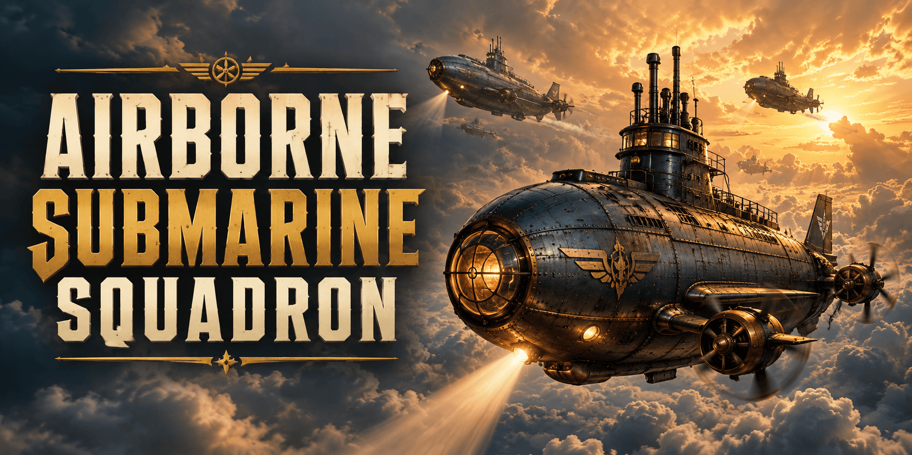

// SPDX-License-Identifier: CC-BY-SA-4.0
// SPDX-FileCopyrightText: 2025-2026 Jonathan D.A. Jewell <j.d.a.jewell@open.ac.uk>

= Airborne Submarine Squadron (ASS)
:toc: macro
:icons: font

image:https://github.com/hyperpolymath/airborne-submarine-squadron/actions/workflows/test.yml/badge.svg[Test Suite,link="https://github.com/hyperpolymath/airborne-submarine-squadron/actions/workflows/test.yml"]
image:https://img.shields.io/badge/License-AGPL_v3-blue.svg[License: AGPL-3.0,link=LICENSE]
image:https://img.shields.io/badge/runtime-Bun-black?logo=bun[Runtime: Bun,link="https://bun.sh"]
image:https://img.shields.io/badge/CRG-C-yellow[Component Readiness Grade C,link="docs/governance/READINESS.adoc"]

_A Sopwith-style arcade game where your *attack submarine* also flies — and when you pull up hard at 88 MPH, leaves the atmosphere._

toc::[]

== Play

[cols="2,3"]
|===
| Zero-install (GitHub Pages) | https://hyperpolymath.github.io/airborne-submarine-squadron/ (deployed by `.github/workflows/pages.yml` on every push to `main`)
| Local server | `bun run run.js` → http://127.0.0.1:6880/
| Desktop window | `./launcher.sh --gossamer` (Gossamer shell; falls back to the local server)
| A specific world | append `?seed=anything` — the same seed always generates the same world (daily challenges, shareable runs)
|===

== Status

Alpha (CRG grade *C*). What is verified *today* — by running the real engine headlessly, not by reading status documents — is in
link:docs/RECON-2026-09.adoc[docs/RECON-2026-09.adoc]. In short:

* The game is playable and deep: atmosphere, water with thermal layers, orbit, enemy AI, weapons, missions, damage model.
* The JavaScript engine is now a *fixed 60 Hz deterministic simulation* with a seeded RNG and render-only interpolation: every
  display refresh rate plays identically, and a (seed, inputs) pair fully determines a run.
* The "sub jumps around the screen" bugs are root-caused, fixed and guarded by tests
  (link:docs/JUMP-BUG-POSTMORTEM.adoc[post-mortem]).
* The AffineScript/WASM core is *not yet functional*: the artifact that used to ship returned an all-zero initial state and
  crashed after ~96 steps. It is no longer shipped; a reference twin, golden vectors and a conformance verifier now define what
  a correct build must do (link:docs/AFFINESCRIPT-PORT-PLAN.adoc[port plan]).
* Where it is going, and how it could become a cult hit:
  link:docs/ROADMAP.adoc[roadmap], link:docs/CULT-GAME-STRATEGY.adoc[strategy],
  link:docs/JOINERY-AND-UPSTREAM-ASKS.adoc[what Gossamer / the Joinery / Burble must deliver].

== Quick start

Prerequisites: https://bun.sh[Bun] ≥ 1.1 (the estate runtime — Deno was retired 2026-09-22), a modern browser. Nothing else: the game has
*zero* dependencies.

[source,bash]
----
bun run run.js            # serve on :6880 and open the game
bun test                  # the whole suite, against the REAL engine (no browser needed)
just --list               # every task (install `just`; or use the commands above)
./build.sh                # OPTIONAL: compile src/main.affine to WASM (needs the AffineScript compiler)
----

The WASM co-processor is optional: without it the game logs `WASM co-processor unavailable` and plays normally.
`run.js` never touches git (the old auto commit/push/merge-to-main cycle is opt-in: `--git-cycle`).

== Controls

Core flight:

* Arrow keys — steer, climb, dive
* Space — fire selected weapon
* Shift — stabilise (air, water and space)
* `A` — afterburner (drains fuel, regenerates); `S` — air/aqua brake
* `P` — periscope (Shift+P: auto mode)
* `E` / `M` — disembark / embark; `Tab` — emergency eject
* `Z` / `X` — aim swivel (on land only)
* `F` — orbit menu (warp); `Enter` confirms; number keys pick a destination in orbit

Weapons: `1` machine gun · `2` torpedo · `3` missile · `4` depth charge · `5` bouncing bomb · `9` railgun (commander)

Pause menu (`Esc`): `[` `]` cycle skin · `,` `.` tune hue · `R` rainbow · `B` spectrum · `P` pride · `L` legend · `H` HALO ·
`D` deep-diver kit · `C` supply frequency · `G` Nemesis sub · `S` save · `O` load · `N` new game · `Q` quit (two-stage) ·
`0`–`9` rebind action · `Backspace` reset keybinds

== Gameplay highlights

* Free flight with afterburner; dive through *three thermal layers* with real visibility rules; caterpillar drive for silent running.
* Leave the atmosphere: 88 MPH + afterburner + sharp pull-up (the "Back to the Future" launch) → orbit with a solar system, asteroids,
  comets, and a sun that burns.
* Weapon triad plus bouncing bomb and railgun; mines with chain reactions; hangars with point-defence; supply drops.
* An enemy roster with personality: Akula-Molot and Delfin submarines, destroyers, a Sopwith Camel that becomes the Red Baron when hit,
  Su-47 Berkut with Lightning interceptor squadrons, the Nemesis sub, Evel Knievel.
* Damage model with hit zones (rear slows, front shields, middle loses buoyancy), commander with 3 hearts, hostage rescue,
  strike and escort missions, end-of-mission scoring.
* Eight sub skins including Spectrum (HSL), Rainbow and Pride.

== Architecture at a glance

[source]
----
index.html / gossamer/index_gossamer.html     two entry points, SAME module list (test-enforced)
  gossamer/*.js        engine: fixed-step update() at 60 Hz, seeded simRand(), render interpolation, draw()
  server/ass-server.js + run.js    Bun game server: allowlisted files, same-origin guard, bounded uploads
  src/main.affine      AffineScript core (ABI v1) → core WASM (optional co-processor)
  sim/                 reference twin + golden vectors + WASM conformance verifier (the oracle)
  test/                bun:test suite + headless harness that boots the real engine
  tray/                Rust system tray (ksni)
----

Details: link:docs/architecture/ARCHITECTURE.adoc[architecture], link:docs/TESTING.adoc[testing],
link:docs/BUN-MIGRATION.adoc[Bun migration].

== Sub skins

Eight skins ship in the pause menu (`[` / `]`): Ocean Blue (default), Retro Red, Amber Gold, Emerald, Violet, *Spectrum Custom*
(HSL, tune with `,` / `.`), *Rainbow* (animated) and *Pride Submarine* (six stripes). Settings persist in `localStorage`
under `airborne-submarine-squadron:gossamer:settings`.

== Contributing

See `.github/CONTRIBUTING.md`, link:GOVERNANCE.adoc[GOVERNANCE], link:SECURITY.adoc[SECURITY]. Before sending a change:
`bun test` must be green. Two rules are enforced by tests because they were the source of real bugs: *simulation code never
calls `Math.random()`* and *canvas `save()`/`restore()` must balance in every function*.

== Licence

// LICENCE-STATUS:BEGIN
Code: *AGPL-3.0-or-later*. Documentation and prose: *CC-BY-SA-4.0*. Full texts in `LICENSES/`. An owner-run migration of the code
licence to *MPL-2.0* is staged but not applied — see link:docs/decisions/ADR-0002-licence-mpl-2.0.adoc[ADR-0002].
// LICENCE-STATUS:END

Gossamer (linear-typed desktop shell), Burble (voice) and AffineScript (affine-typed language compiling to WASM) are separate
projects under their own licences; see link:docs/JOINERY-AND-UPSTREAM-ASKS.adoc[the ecosystem map].
